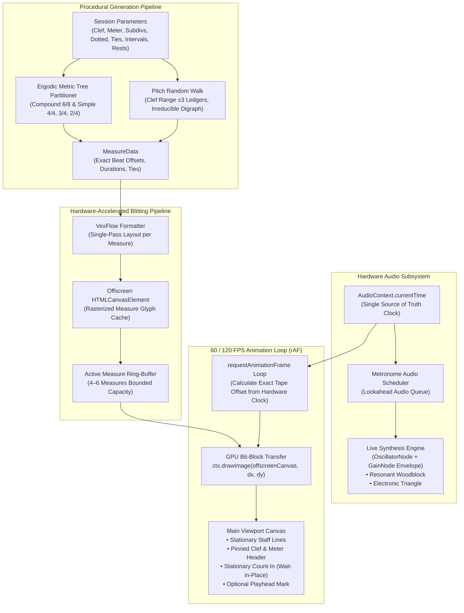

# Guidonica

> **Guidonica** is a high-performance, client-only web engine for deliberate sight-reading and solfège practice, inspired by Guido d'Arezzo's historic pedagogical method. It continuously streams procedurally generated sheet music across a fixed playhead in sample-accurate synchronization with a Web Audio synthesized metronome—built with zero framework bloat in pure Vanilla TypeScript, pure CSS3 liquid glass, and 60/120 FPS GPU blitting.

**Live Application**: [https://guidonica.it](https://guidonica.it) *(mirror: [hand-lock.github.io/guidonica](https://hand-lock.github.io/guidonica/))* &nbsp;|&nbsp; [](LICENSE) [](https://nodejs.org/) [](https://pnpm.io/) [](https://www.typescriptlang.org/) [](https://github.com/Hand-Lock/guidonica/actions)

---

## Table of Contents
- [Heritage & Pedagogical Rationale](#heritage--pedagogical-rationale)
- [The "Suckless" Engineering Axioms](#the-suckless-engineering-axioms)
- [System Architecture & Data Flow](#system-architecture--data-flow)
- [Comprehensive Feature Tour](#comprehensive-feature-tour)
  - [Complete Setticlavio Clef System](#1-complete-setticlavio-clef-system-8-clefs)
  - [Ergodic Metric Tree Rhythm Generation](#2-ergodic-metric-tree-rhythm-generation)
  - [Arbitrary n-Tuplet Matrix Engine](#3-arbitrary-n-tuplet-matrix-engine)
  - [Multi-Interval Pitch Random Walk](#4-multi-interval-pitch-random-walk)
  - [Solfège Syllable Overlays & Note Labels](#5-solfège-syllable-overlays--note-labels)
  - [Synthesized Metronome & Woodblock Timbre](#6-synthesized-metronome--woodblock-timbre)
  - [Stationary Wait-In-Place Count-In](#7-stationary-wait-in-place-count-in)
  - [Stationary Stave Header](#8-stationary-stave-header--gradient-mask)
  - [Device-Adaptive Zoom & Forereading](#9-device-adaptive-zoom--sight-reading-forereading)
  - [Unassisted Sight-Reading Mode](#10-unassisted-sight-reading-mode-toggleable-playhead)
  - [Native Device & Lifecycle Resilience](#11-native-device--lifecycle-resilience)
  - [Aero-Guidonica Skeuomorphic Design](#12-aero-guidonica-skeuomorphic-design-system)
- [Keyboard Controls & Shortcuts](#keyboard-controls--shortcuts)
- [Quickstart & Local Development](#quickstart--local-development)
- [macOS & Apple Silicon Guide](#macos--apple-silicon-m1m2m3m4-guide)
- [Available Scripts](#available-scripts)
- [Continuous Deployment & Custom Domain](#continuous-deployment--custom-domain)
- [Architectural Decision Records (ADRs)](#architectural-decision-records-adrs)
- [License & Copyleft Terms](#license--copyleft-terms)

---

## Heritage & Pedagogical Rationale

**Guidonica** takes its name from **Guido d'Arezzo** (c. 991 – after 1033), the Italian medieval Benedictine monk and music theorist whose treatises laid the bedrock of Western musical notation: the modern 4-line and 5-line staff notation, hexachordal solmization (*ut, re, mi, fa, sol, la*), and the celebrated **Manus Guidonica** (Guidonian Hand).

The *manus guidonica* was history's first spatial visual-mnemonic sight-singing interface: choir apprentices mapped musical intervals, hexachords, and syllables directly to the joints and tips of the human hand to internalize real-time pitch recognition and eliminate rote memorization. Guidonica translates this historical pedagogical breakthrough into a modern, continuous digital medium:

1. **Anticipatory Eye Scanning (Forereading)**:
   Traditional sheet music reading suffers from cognitive "page-turn panic", fixation stutter, and erratic eye wandering. Guidonica's unyielding, continuous horizontal tape trains the musician's eye to actively scan ahead of the playhead, recognizing upcoming interval patterns, melodic contours, and rhythmic groupings well before vocalizing or playing them.
2. **Frictionless Deliberate Practice (Zero Evaluation Overhead)**:
   Guidonica acts as an unwavering rhythmic pacing partner. It deliberately omits microphone pitch tracking, scoring algorithms, latency-inducing audio processing, or gamified leaderboards. The musician self-monitors their vocalized solfège or instrumental execution directly against the physical acoustic click and the oncoming notation.
3. **The Ergodic Principle (State-Space Completeness)**:
   Pedagogically, true sight-reading mastery requires confronting every syntactically valid permutation within a musical curriculum. If software artificially favors common clichés or censors complex figures (e.g., omitting quarter-eighth syncopations in 6/8 or quarter-half pairs in 3/4), the student develops severe cognitive blind spots. Guidonica treats the user's active configuration as a bounded musical universe $\Omega$: every mathematically valid measure possesses a strictly non-zero probability of generation ($P(\omega) > 0, \forall \omega \in \Omega$).
4. **Unassisted Sight-Reading Mode**:
   While the high-contrast playhead cursor provides immediate spatial grounding for beginners, advanced sight-reading requires reading unassisted without a visual crutch. Guidonica allows the playhead cursor to be toggled off at any moment (via UI or pressing `P`), challenging the musician to track the flow purely from their internal pulse.

---

## The "Suckless" Engineering Axioms

Guidonica is constructed upon an uncompromising **suckless, ultra-lightweight, and zero-bloat engineering philosophy**, rejecting the sluggish dependencies and virtual abstractions of modern web stacks:

1. **Zero Framework Bloat (Vanilla TypeScript)**:
   - Written exclusively in **Vanilla TypeScript** driving native DOM APIs, HTML5 Canvas, and the Web Audio API directly.
   - Zero React, Vue, Svelte, or Angular. Zero Virtual DOM reconciliation overhead.
   - Zero external state management libraries (no Redux, MobX, Zustand, or Pinia).
   - Entire application JavaScript (excluding VexFlow) is only **~16.8 kB gzipped** (`67.6 kB` uncompressed).
2. **Single Authoritative Hardware Clock (`AudioContext.currentTime`)**:
   - Visual scroller movement and synthesized audio pulse scheduling are mathematically locked to the hardware audio clock (`AudioContext.currentTime`).
   - Zero `setInterval`, `setTimeout`, or visual delta-time accumulators.
   - Noteheads cross the playhead mark at the exact physical microsecond the speaker driver clicks—visual-auditory drift is mathematically impossible.
3. **Hardware-Accelerated Measure Blitting Pipeline**:
   - VexFlow renders each measure **once** onto an offscreen `HTMLCanvasElement`.
   - The 60/120 FPS animation loop (`requestAnimationFrame`) exclusively executes GPU-accelerated bit-block transfers (`ctx.drawImage()`).
   - Zero per-frame layout recalculations, zero font parsing per frame, sub-millisecond per-frame CPU execution (< 1% CPU utilization).
4. **Bounded Ring-Buffer & Zero-Leak Memory Discipline**:
   - Only **4 to 6 measures** exist in memory at any given time.
   - Measures that scroll past the left edge of the viewport are immediately evicted from the ring-buffer and their offscreen canvases dereferenced.
   - An infinite 3-hour practice session maintains the exact same memory footprint (~30–45 MB total process memory) as a 5-second quick test.
5. **Synthesized Hardware Audio (0-Byte Sample Downloads)**:
   - Metronome pulses and woodblock timbres are synthesized live on the audio hardware using Web Audio `OscillatorNode` (sine/triangle) and exponential `GainNode` envelopes.
   - Zero audio sample files (MP3/WAV/OGG) downloaded across the network.
6. **Ergodic Metric Tree Procedural Generation**:
   - Rhythms are partitioned via recursive metric tree subdivision based on exact rational time signature fractions.
   - Pitches are generated via an irreducible, strongly connected Markov random walk with boundary reflection bias. Zero heavyweight music theory AI, zero rule engines, zero network dependencies.
7. **Pure CSS3 Liquid Glass UI (Zero CSS Frameworks)**:
   - The entire Frutiger Aero / Aqua / Liquid Glass visual design is constructed with 100% pure, hardware-composited CSS3 (`backdrop-filter`, multi-stop linear/radial gradients, beveled glass borders, tactile inset/drop shadows).
   - Zero Tailwind runtime, zero CSS-in-JS runtimes, zero heavy sprite textures.
   - Entire stylesheet is only **~5.9 kB gzipped** (`34.8 kB` uncompressed).
8. **Native Device & Lifecycle Resilience**:
   - Integrates modern Web APIs including Screen Wake Lock (`navigator.wakeLock`), Page Visibility lifecycle auto-pause, dynamic iOS `AVAudioSession` category switching (`playback` mode to bypass physical silent switches), and Fullscreen API.

---

## System Architecture & Data Flow



---

## Comprehensive Feature Tour

### 1. Complete Setticlavio Clef System (8 Clefs)
Guidonica supports the full historic **Setticlavio** (seven clefs) traditional vocal and instrumental clef system, featuring both historical positions of the baritone clef:
- **Treble (G2)** (`treble`): G clef on line 2, range E3 – F6.
- **Soprano (C1)** (`soprano`): C clef on line 1, range C3 – D6.
- **Mezzo-Soprano (C2)** (`mezzo-soprano`): C clef on line 2, range A2 – B5.
- **Alto (C3)** (`alto`): C clef on line 3, range F2 – G5.
- **Tenor (C4)** (`tenor`): C clef on line 4, range D2 – E5.
- **Baritone (F3)** (`baritone-f`): F clef on line 3, range B1 – C5.
- **Baritone (C5)** (`baritone-c`): C clef on line 5, range B1 – C5.
- **Bass (F4)** (`bass`): F clef on line 4, range G1 – A4.

Pitches are strictly bounded to the stave lines plus exactly **$\pm 3$ ledger lines** above and below (spanning exactly 23 diatonic pitch steps for each clef). Dynamic clef range hints update automatically in the settings drawer.

### 2. Ergodic Metric Tree Rhythm Generation
The rhythm engine decomposes each measure top-down based on exact rational time signature fractions:
- **Compound Meter (6/8)**: Supports macro-dotted-half measures (`hd`), paired dotted-quarters (`qd qd`), quarter-eighth figures (`q 8` and `8 q`), running eighth notes (`8 8 8`), and sixteenth-note subdivisions.
- **Simple Triple Meter (3/4)**: Generates dotted-half notes (`hd`), half-quarter pairings (`h q` and `q h`), and individual beat subdivisions.
- **Simple Quadruple & Duple (4/4, 2/4)**: Partitions measures preserving metric half-bar clarity (beats 1–2 and beats 3–4), supporting whole notes (`w`), half notes (`h`), dotted quarters with eighths (`qd 8` and `8 qd`), quarter notes (`q`), eighth notes (`8`), and sixteenth notes (`16`).
- **Dotted Rhythms**: Dedicated toggle enabling dotted figures (`hd`, `qd`, `8d`) without breaking metric integrity.
- **Cross-Beat Tied Notes**: Ties notes across metric subdivisions with pitch preservation ($p_{i+1} = p_i$) and VexFlow `StaveTie` rendering.
- **Rhythmic Rests**: Toggleable rests (quarter and eighth rests) embedded directly into metric subdivisions.

### 3. Arbitrary n-Tuplet Matrix Engine
A dedicated tuplet configuration menu allows selecting any combinations of:
- **Tuplet Ratios**: Duplets (2:3), Triplets (3:2), Quadruplets (4:3), Quintuplets (5:4), Sextuplets (6:4), and Septuplets (7:4).
- **Base Note Values**: Quarter notes (`1/4`), Eighth notes (`1/8`), and Sixteenth notes (`1/16`).
- **Engraving Polish**: Automated unified stem direction grouping, bracketed ratio displays, and metric width compensation.

### 4. Multi-Interval Pitch Random Walk
Pitch transitions are governed by an irreducible Markov chain with boundary reflection:
- **Selectable Intervals**: Granular checkboxes for Unison (1st), Second (2nd / stepwise), Third (3rd / skip), Fourth (4th), Fifth (5th), Sixth (6th), Seventh (7th), Octave (8ve leap), and Ninth Plus (9+ compound intervals).
- **Ledger Boundary Reflection**: Inward boundary bias prevents notes from straying beyond the $\pm 3$ ledger line range while maintaining ergodic exploration of the full clef gamut.

### 5. Solfège Syllable Overlays & Note Labels
Overhead syllable and letter indicators assist ear training and note identification:
- **Solfège (Fixed-Do / Anglo-American)**: `Do`, `Re`, `Mi`, `Fa`, `Sol`, `La`, `Ti`.
- **Italian Solfège (Setticlavio Standard)**: `Do`, `Re`, `Mi`, `Fa`, `Sol`, `La`, `Si`.
- **Note Letters**: `C`, `D`, `E`, `F`, `G`, `A`, `B`.
- **Vertical Clearance Transform**: Offscreen canvas renders dynamically shift downward by 20px when labels are enabled, preventing text from colliding with upper ledger lines or beams.

### 6. Synthesized Metronome & Woodblock Timbre
- **Sound Profiles**:
  - **Woodblock (Default)**: Organic resonant woodblock synthesized via exponentially damped high-frequency sines with bandpass character.
  - **Electronic Triangle**: Crisp, uncolored triangle-wave oscillator clicks.
- **Accented Beats**: Downbeats synthesize at a higher pitch (1200 Hz) than subsequent beats (800 Hz).
- **6/8 Pulse Grouping**: Selectable between 2 compound beats (dotted-quarter pulses ♩.) or 6 metric beats (eighth-note pulses ♪).
- **Volume & Mute**: Direct volume slider with instant mute toggle.

### 7. Stationary Wait-In-Place Count-In
- When **Count-In** is enabled, starting playback initiates a 1-measure preparatory count-in.
- **Wait-In-Place Mechanics**: The notation tape does not move during count-in; Measure 0 rests stationary directly under the playhead, giving the musician time to read the initial notes and internalize the tempo before tape motion begins on Beat 1.
- **Visual Feedback**: A stacked `COUNT-IN` badge and dynamic animated beat dots flash in real time with each metronome strike.

### 8. Stationary Stave Header & Gradient Mask
- The active clef and selected time signature remain permanently pinned to the left edge of the stave canvas on an offscreen-rendered stationary header.
- A smooth linear gradient fade protects the stationary header from scrolling note glyphs, creating a seamless visual entry point.

### 9. Device-Adaptive Zoom & Sight-Reading Forereading
- **Automatic Sight-Reading Forereading**: Sizing algorithms calculate the exact scale required to keep at least one full measure visible ahead of the playhead on any screen width (mobile, tablet, or desktop ultrawide).
- **Integer Staff Quantization**: Zoom scales are quantized to integer tenths (`10 * Z \in \mathbb{Z}`) ensuring staff lines align cleanly with screen pixels without antialiasing blur.
- **Manual Controls & Floating Pill**: On-canvas floating liquid glass zoom pill (`-`, `100%`, `+`) alongside header slider and keyboard shortcuts.

### 10. Unassisted Sight-Reading Mode (Toggleable Playhead)
- A stationary red playhead cursor with top and bottom guide triangles marks the exact instant of downbeat arrival.
- Musician can toggle the playhead off at any time using the UI switch or the **`P`** key to practice unassisted eye-tracking for performance preparation.

### 11. Native Device & Lifecycle Resilience
- **Page Lifecycle Auto-Pause**: Automatically pauses playback when switching browser tabs or minimizing the window (`visibilitychange` / `pagehide`), resuming cleanly without phase jitter.
- **AudioContext State Recovery**: Restores Web Audio contexts interrupted by system sleep, phone calls, or audio route changes.
- **Screen Wake Lock**: Uses `navigator.wakeLock` to prevent the device display from dimming or sleeping during long practice sessions.
- **iOS AudioSession Silent Mode Bypass**: Uses the W3C WebKit `navigator.audioSession` API to engage `playback` mode during practice (enabling audio through the speaker even if the iPhone physical mute switch is toggled), dropping cleanly back to `ambient` on pause.
- **Fullscreen API**: Clean toggle to enter immersive full-window notation mode, with capability detection that hides the button on unsupported devices (e.g., iPhone Safari).

### 12. Aero-Guidonica Skeuomorphic Design System
Constructed strictly following the [Aero-Guidonica Design Manifesto](docs/DESIGN_MANIFESTO.md):
- **Liquid Glass Aesthetic**: Translucent acrylic panels, hardware-composited `backdrop-filter: blur(16px)`, specular glass highlights, and multi-layered inner and drop shadows.
- **Olo Chromatic Accent (`#00FFCC`)**: A high-luminance, 100% pure cyan-green accent inspired by classic 2000s media players, providing maximum perceptual contrast in both light and dark modes.
- **Curated Typography**:
  - **Alegreya**: Classic humanist serif with Renaissance calligraphic roots, used for brand identity and editorial titles.
  - **Alegreya Sans**: Ergonomic humanist sans-serif for UI labels, buttons, and settings controls.
  - **Ubuntu Mono**: Engineered monospace numerals for steady, non-jumping BPM and metric readouts.
- **Handcrafted Vector Music Icons**: Custom inlined SVG glyphs for quarter, eighth, half, whole, sixteenth, dotted, rest, tie, and playhead icons.
- **Auto OS Night Mode**: Dynamically follows the user's operating system dark/light mode preference (`prefers-color-scheme`) with manual overrides.

---

## Keyboard Controls & Shortcuts

| Key | Action | Description |
| :--- | :--- | :--- |
| <kbd>Space</kbd> | **Start / Pause** | Toggle playback or resume seamlessly from the current position |
| <kbd>R</kbd> or <kbd>Esc</kbd> | **Reset** | Rewind tape to measure 0 and re-seed the procedural generator |
| <kbd>P</kbd> | **Toggle Playhead** | Show or hide the stationary red playhead cursor (Unassisted Mode) |
| <kbd>↑</kbd> (Up) | **Tempo +5 BPM** | Increase tempo by 5 BPM |
| <kbd>↓</kbd> (Down) | **Tempo -5 BPM** | Decrease tempo by 5 BPM |
| <kbd>Shift</kbd> + <kbd>↑</kbd> | **Tempo +1 BPM** | Precision increase tempo by 1 BPM |
| <kbd>Shift</kbd> + <kbd>↓</kbd> | **Tempo -1 BPM** | Precision decrease tempo by 1 BPM |
| <kbd>+</kbd> or <kbd>=</kbd> | **Zoom In** | Increase notation scale by 10% |
| <kbd>-</kbd> or <kbd>_</kbd> | **Zoom Out** | Decrease notation scale by 10% |
| <kbd>0</kbd> | **Auto Zoom** | Recalculate and reset to optimal device-adaptive forereading zoom |

---

## Quickstart & Local Development

### Prerequisites
- **Node.js**: `>= 22.13.0` (Node 22 LTS). Check your active version with `node -v`.
- **Package Manager**: `pnpm@11.8.0` (recommended) or `npm`.

### Installation & Run

```bash
# 1. Clone the repository
git clone https://github.com/Hand-Lock/guidonica.git
cd guidonica

# 2. Install dependencies
pnpm install

# 3. Start local development server
pnpm dev
```

Open your browser at **`http://localhost:3000`** (or the port reported in your terminal).

---

## macOS & Apple Silicon (M1/M2/M3/M4) Guide

Guidonica is fully tested and optimized for macOS and Apple Silicon:
1. **Native ARM64 Architecture**:
   `pnpm-lock.yaml` provides pre-resolved native `@esbuild/darwin-arm64` and `@rollup/rollup-darwin-arm64` binaries; `pnpm install` executes with zero Rosetta 2 translation.
2. **Web Audio Gesture Unlock**:
   WebKit and Chromium browsers enforce strict autoplay restrictions on macOS. Guidonica creates and unlocks the `AudioContext` within the direct user gesture (clicking **Start** or pressing <kbd>Space</kbd>).
3. **Retina Display Hi-DPI Scaling**:
   The scroller canvas automatically adapts to `window.devicePixelRatio: 2` (or 3), supersampling the offscreen and display buffers so noteheads, stems, and staff lines remain razor-sharp.
4. **macOS SSH Keychain for Remote Deployment**:
   When pushing updates from agent or non-interactive shells, load your Keychain credentials:
   ```bash
   ssh-add --apple-load-keychain 2>&1 && git push origin main
   ```

---

## Available Scripts

| Command | Description |
| :--- | :--- |
| `pnpm dev` | Starts the Vite development server on `http://localhost:3000` with instant HMR. |
| `pnpm typecheck` | Validates TypeScript types strictly (`tsc --noEmit`) with zero errors. |
| `pnpm test` | Runs the Vitest automated test suite (71 tests across 11 test suites). |
| `pnpm test:watch` | Runs Vitest in interactive watch mode for test-driven development. |
| `pnpm build` | Executes strict typecheck and compiles production bundle into `dist/`. |
| `pnpm preview` | Serves the production build locally for verification. |

---

## Continuous Deployment & Custom Domain

This repository is configured for automated testing, building, and zero-downtime deployment to **GitHub Pages** via **GitHub Actions**.

### Automated CI/CD Workflow
Every commit pushed to the `main` branch automatically triggers [`.github/workflows/deploy.yml`](.github/workflows/deploy.yml):
1. **Validation**: Strictly typechecks TypeScript (`tsc --noEmit`) and runs all unit tests.
2. **Build**: Compiles production bundles with relative asset paths (`base: './'`) and isolates VexFlow into a cached vendor chunk.
3. **Deploy**: Uploads the production artifact and publishes it to GitHub Pages.

### Custom Domain Architecture (`guidonica.it`)
The production application is served under the apex domain **`https://guidonica.it`**:
- **DNS Configuration**: Apex `@` A-records pointing to GitHub Pages IP infrastructure (`185.199.108.153`, `185.199.109.153`, `185.199.110.153`, `185.199.111.153`) and `www` CNAME record pointing to `hand-lock.github.io`.
- **Repository Root CNAME**: The `CNAME` file in the root specifies `guidonica.it`.
- **Automatic HTTPS**: TLS certificates are provisioned and renewed automatically via Let's Encrypt through GitHub Pages.

---

## Architectural Decision Records (ADRs)

All core architecture, math formulas, rendering mechanisms, and design decisions are formally documented in [`docs/adr/`](docs/adr/README.md):

| ADR | Title | Status |
| :--- | :--- | :--- |
| [0001](docs/adr/0001-core-architecture-and-rendering-pipeline.md) | Core Architecture, Metric Linearity & Blitting Pipeline | Accepted |
| [0002](docs/adr/0002-light-theme-standardization.md) | Light Theme Standardization & High-Contrast Canvas Rendering | Accepted |
| [0003](docs/adr/0003-infinite-stream-stave-alignment-and-barlines.md) | Infinite Streaming Buffer, Stave Alignment & Barline Rendering | Accepted |
| [0004](docs/adr/0004-beaming-geometry-and-stave-attachment.md) | Beaming Geometry, Stave Attachment & Stem Extension Alignment | Accepted |
| [0005](docs/adr/0005-dynamic-subdivision-beat-width-and-stave-padding-compensation.md) | Dynamic Subdivision Beat Width & Stave Padding Compensation | Accepted |
| [0006](docs/adr/0006-multi-interval-selection-and-clef-pitch-pools.md) | Multi-Interval Checkbox Selection & Clef-Dependent Pitch Pools (±3 Ledger Lines) | Accepted |
| [0007](docs/adr/0007-comprehensive-system-audit-and-optimizations.md) | Comprehensive System Audit, Glitch Elimination & Performance Optimizations | Accepted |
| [0008](docs/adr/0008-pause-and-resume-state-synchronization.md) | Pause and Resume State Synchronization & Beat Grid Phase Alignment | Accepted |
| [0009](docs/adr/0009-cross-platform-portability-and-github-synchronization.md) | Cross-Platform Portability, macOS Apple Silicon Support & GitHub Synchronization | Accepted |
| [0010](docs/adr/0010-separate-tuplet-subdivision-matrix-menu.md) | Separate Tuplet Subdivision Matrix Menu & Arbitrary n-Tuplet Engine | Accepted |
| [0011](docs/adr/0011-tuplet-beam-stem-direction-unification.md) | Tuplet Beam Stem Direction Unification & Contiguous Non-Tuplet Grouping | Accepted |
| [0012](docs/adr/0012-web-font-synchronization-and-clef-invalidation.md) | Web Font Loading Synchronization & Pinned Clef Cache Invalidation | Accepted |
| [0013](docs/adr/0013-production-readiness-and-high-dpi-retina-pipeline.md) | Production Readiness, High-DPI Retina Pipeline & Audio Polish | Accepted |
| [0014](docs/adr/0014-solfege-label-transform-and-vertical-clearance.md) | Solfège Label Context Transform & Vertical Clearance Architecture | Accepted |
| [0015](docs/adr/0015-italian-solfege-and-cross-platform-auto-night-mode.md) | Italian Solfège Syllables and Cross-Platform OS-Aligned Auto Night Mode | Accepted |
| [0016](docs/adr/0016-default-woodblock-metronome-and-auto-theme.md) | Default Woodblock Metronome Profile and Auto OS Theme Mode | Accepted |
| [0017](docs/adr/0017-vector-music-icons-cross-platform-ui.md) | Vector Music Notation Icons for Cross-Platform UI Controls | Accepted |
| [0018](docs/adr/0018-github-actions-pages-continuous-deployment.md) | Continuous Deployment to GitHub Pages via GitHub Actions & Custom Domain Readiness | Accepted |
| [0019](docs/adr/0019-licensing-strict-copyleft-agplv3.md) | Strict Copyleft Open-Source Licensing (GNU AGPLv3) | Accepted |
| [0020](docs/adr/0020-in-app-license-and-repository-ui.md) | In-App License and Repository Presentation Architecture | Accepted |
| [0021](docs/adr/0021-project-rebranding-guidonica.md) | Project, Web-App, and Repository Rebranding to Guidonica | Accepted |
| [0022](docs/adr/0022-aero-skeuomorphic-design-system-and-manifesto.md) | Aero-Guidonica Skeuomorphic Design System, Alegreya Typography, and Design Manifesto | Accepted |
| [0023](docs/adr/0023-ubuntu-mono-monospace-typography.md) | Ubuntu Mono Monospace Typography and Numeric System | Accepted |
| [0024](docs/adr/0024-haptic-feedback-feasibility-and-rejection.md) | Technical Feasibility Evaluation and Rejection of Web Haptic Motor Feedback | Decided |
| [0025](docs/adr/0025-in-app-notation-zoom-and-mobile-ergonomics.md) | In-App Notation Zoom & Mobile Ergonomics | Accepted |
| [0026](docs/adr/0026-stationary-time-signature-and-stave-header.md) | Stationary Selected Time Signature & Left Stave Header | Accepted |
| [0027](docs/adr/0027-ios-silent-mode-dynamic-audio-session.md) | Dynamic iOS AudioSession: Ambient UI & Playback Metronome | Accepted |
| [0028](docs/adr/0028-device-adaptive-zoom-and-sight-reading-forereading.md) | Device-Adaptive Zoom & Sight-Reading Forereading | Accepted |
| [0029](docs/adr/0029-stationary-count-in-wait-in-place.md) | Stationary Count-In Wait-In-Place | Accepted |
| [0030](docs/adr/0030-stacked-count-in-indicator-and-mobile-traffic-lights.md) | Stacked Count-In Indicator and Mobile Traffic Lights Geometry | Accepted |
| [0031](docs/adr/0031-custom-domain-guidonica-it.md) | Custom Domain Infrastructure (guidonica.it) via Register.it and GitHub Pages | Accepted |
| [0032](docs/adr/0032-olo-chromatic-accent-and-design-principle.md) | Olo (#00FFCC) Chromatic Accent, Perceptual Color Principle, and Liquid Gel Palette Architecture | Accepted |
| [0033](docs/adr/0033-fullscreen-api-feature-detection-and-selective-ui-presentation.md) | Fullscreen API Capability Detection & Selective UI Presentation | Accepted |
| [0034](docs/adr/0034-matched-segmented-square-fullscreen-icons.md) | Matched Segmented-Square Fullscreen Icons & Inverted Exit Geometry | Accepted |
| [0035](docs/adr/0035-page-lifecycle-auto-pause-and-screen-wake-lock.md) | Page Lifecycle Auto-Pause, AudioContext State Recovery & Screen Wake Lock | Accepted |
| [0036](docs/adr/0036-ergodic-metric-tree-procedural-generation-and-dotted-rhythms.md) | Ergodic Metric Tree Procedural Generation, Dotted Rhythms & Tied Notes | Accepted |
| [0037](docs/adr/0037-toggleable-playhead-mark-visibility.md) | Toggleable Playhead Mark Visibility & Unassisted Sight-Reading Mode | Accepted |
| [0038](docs/adr/0038-setticlavio-complete-clef-system.md) | Setticlavio Complete Clef System: Soprano, Mezzo-Soprano, and Dual Baritone (F & C) Integration | Accepted |

---

## License & Copyleft Terms

This project is free and open-source software licensed under the **[GNU Affero General Public License v3.0 or later (AGPL-3.0-or-later)](LICENSE)**.

Copyright &copy; 2026 **A. C. Lo Cascio**.

### Copyleft & Network Reciprocity (Section 13)
- **User Freedoms**: You are free to run, study, inspect, modify, and redistribute this software.
- **Network Copyleft**: In accordance with Section 13 of the GNU AGPLv3, if you modify this program and run it on a server or host it as a network or cloud service where users interact with it remotely over a computer network, you **must make the complete Corresponding Source code of your modified version available to all users at no charge**, via a prominent network facility (such as a public Git repository).
- **Third-Party Acknowledgements**: Music notation typesetting and stave vector layout are powered by [VexFlow](https://github.com/vexflow/vexflow), licensed under the [MIT License](https://github.com/vexflow/vexflow/blob/master/LICENSE.txt).
