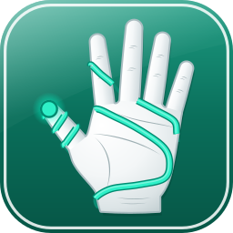
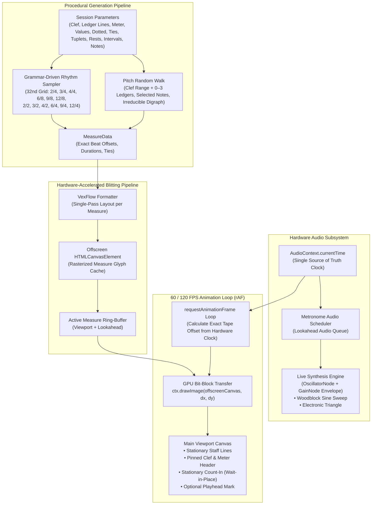

<p align="center"></p>

# Guidonica

**Free sight-reading and solfège practice in your browser.** Endless fresh sheet music scrolls past a playhead in time with a metronome, at the level you choose, from first steps to every tuplet. No sign-up, no ads, no tracking, and it works on phones, tablets and desktops in English, Italian, French, German and Spanish.

**▶ Practice now at [guidonica.it](https://guidonica.it)**

https://github.com/user-attachments/assets/fc6b1dc2-3802-40bb-8175-ab54c51cde60

*24-second trailer: tempo 100→160, triplets, alto clef, wide leaps, five languages. Also on [Instagram @guidonica.it](https://www.instagram.com/guidonica.it/).*

> **Guidonica** is a high-performance, client-only web engine for deliberate sight-reading and solfège practice, inspired by Guido d'Arezzo's historic pedagogical method. It continuously streams procedurally generated sheet music across a fixed playhead in sample-accurate synchronization with a Web Audio synthesized metronome—built with zero framework bloat in pure Vanilla TypeScript, pure CSS3 liquid glass, and 60/120 FPS GPU blitting.

**Live Application**: [https://guidonica.it](https://guidonica.it) &nbsp;|&nbsp; [](LICENSE) [](https://nodejs.org/) [](https://pnpm.io/) [](https://www.typescriptlang.org/) [](https://github.com/Hand-Lock/guidonica/actions/workflows/deploy.yml)

---

## Table of Contents
- [Heritage & Pedagogical Rationale](#heritage--pedagogical-rationale)
- [The "Suckless" Engineering Axioms](#the-suckless-engineering-axioms)
- [System Architecture & Data Flow](#system-architecture--data-flow)
- [Comprehensive Feature Tour](#comprehensive-feature-tour)
  - [Level Presets & Onboarding](#1-level-presets--onboarding)
  - [Settings at a Glance](#2-settings-at-a-glance)
  - [Complete Setticlavio Clef System](#3-complete-setticlavio-clef-system-8-clefs)
  - [Ergodic Grammar-Driven Rhythm Generation](#4-ergodic-grammar-driven-rhythm-generation)
  - [Arbitrary n-Tuplet Matrix Engine](#5-arbitrary-n-tuplet-matrix-engine)
  - [Multi-Interval Pitch Random Walk](#6-multi-interval-pitch-random-walk)
  - [Note Labels: Syllables & Letters](#7-note-labels-syllables--letters)
  - [Tempo & Italian Markings](#8-tempo--italian-markings)
  - [Synthesized Metronome & Woodblock Timbre](#9-synthesized-metronome--woodblock-timbre)
  - [Stationary Wait-In-Place Count-In](#10-stationary-wait-in-place-count-in)
  - [Stationary Stave Header](#11-stationary-stave-header--gradient-mask)
  - [Device-Adaptive Zoom & Forereading](#12-device-adaptive-zoom--sight-reading-forereading)
  - [Unassisted Sight-Reading Mode](#13-unassisted-sight-reading-mode-toggleable-playhead)
  - [Five Languages & National Note Names](#14-five-languages--national-note-names)
  - [Shareable Exercise Links](#15-shareable-exercise-links)
  - [Tips & What's New](#16-tips--whats-new)
  - [Native Device & Lifecycle Resilience](#17-native-device--lifecycle-resilience)
  - [Aero-Guidonica Skeuomorphic Design](#18-aero-guidonica-skeuomorphic-design-system)
- [Keyboard Controls & Shortcuts](#keyboard-controls--shortcuts)
- [Quickstart & Local Development](#quickstart--local-development)
- [macOS & Apple Silicon Guide](#macos--apple-silicon-m1m2m3m4-guide)
- [Available Scripts](#available-scripts)
- [Releases & Nightly](#releases--nightly)
- [Continuous Deployment & Custom Domain](#continuous-deployment--custom-domain)
- [Architectural Decision Records (ADRs)](#architectural-decision-records-adrs)
- [Contributing](#contributing)
- [Contact](#contact)
- [License & Copyleft Terms](#license--copyleft-terms)

---

## Heritage & Pedagogical Rationale

**Guidonica** takes its name from **Guido d'Arezzo** (c. 991 – after 1033), the Italian medieval Benedictine monk and music theorist whose treatises laid the bedrock of Western musical notation: the modern 4-line and 5-line staff notation, hexachordal solmization (*ut, re, mi, fa, sol, la*), and the celebrated **Manus Guidonica** (Guidonian Hand).

The *manus guidonica* was history's first spatial visual-mnemonic sight-singing interface: choir apprentices mapped musical intervals, hexachords, and syllables directly to the joints and tips of the human hand to internalize real-time pitch recognition and eliminate rote memorization. The project's logo *is* a Manus Guidonica: the student's own left palm, with the gamut thread starting at **Γ** (*gamma ut*) on the thumb tip and coiling down through **A** and **B**, the first steps of the hand's historical order ([ADR 0047](docs/adr/0047-guidonian-hand-v2.md)).

Guidonica translates this historical pedagogical breakthrough into a modern, continuous digital medium:

1. **Anticipatory Eye Scanning (Forereading)**:
   Traditional sheet music reading suffers from cognitive "page-turn panic", fixation stutter, and erratic eye wandering. Guidonica's unyielding, continuous horizontal tape trains the musician's eye to actively scan ahead of the playhead, recognizing upcoming interval patterns, melodic contours, and rhythmic groupings well before vocalizing or playing them.
2. **Frictionless Deliberate Practice (Zero Evaluation Overhead)**:
   Guidonica acts as an unwavering rhythmic pacing partner. It deliberately omits microphone pitch tracking, scoring algorithms, latency-inducing audio processing, or gamified leaderboards. The musician self-monitors their vocalized solfège or instrumental execution directly against the physical acoustic click and the oncoming notation.
3. **The Ergodic Principle (State-Space Completeness)**:
   Pedagogically, true sight-reading mastery requires confronting every syntactically valid permutation within a musical curriculum. If software artificially favors common clichés or censors complex figures (e.g., omitting quarter-eighth syncopations in 6/8 or quarter-half pairs in 3/4), the student develops severe cognitive blind spots. Guidonica treats the user's active configuration as a bounded musical universe $\Omega$: every mathematically valid measure possesses a strictly non-zero probability of generation ($P(\omega) > 0, \forall \omega \in \Omega$).
4. **Unassisted Sight-Reading Mode**:
   While the high-contrast playhead cursor provides immediate spatial grounding for beginners, advanced sight-reading requires reading unassisted without a visual crutch. Guidonica allows the playhead cursor to be toggled off at any moment (via UI or pressing `P`), challenging the musician to track the flow purely from their internal pulse.

---

## The "Suckless" Engineering Axioms

Guidonica is constructed upon an uncompromising **suckless, ultra-lightweight, and zero-bloat engineering philosophy**, rejecting the sluggish dependencies and virtual abstractions of modern web stacks:

1. **Zero Framework Bloat (Vanilla TypeScript)**:
   - Written exclusively in **Vanilla TypeScript** driving native DOM APIs, HTML5 Canvas, and the Web Audio API directly.
   - Zero React, Vue, Svelte, or Angular. Zero Virtual DOM reconciliation overhead.
   - Zero external state management libraries (no Redux, MobX, Zustand, or Pinia).
   - Entire shipped JavaScript is **~130 kB gzipped**: ~37 kB of application code (including the English dictionary) plus ~93 kB of VexFlow's font-free `vexflow/core` build. Each other language is one lazy **~5.7 kB** chunk ([ADR 0059](docs/adr/0059-localization-and-national-note-naming.md)). The music font is a separate **19.6 kB** Bravura subset ([ADR 0058](docs/adr/0058-music-font-audit-and-bravura-subset.md)) instead of the ~600 kB of base64 fonts the full VexFlow entry inlines.
2. **Single Authoritative Hardware Clock (`AudioContext.currentTime`)**:
   - Visual scroller movement and synthesized audio pulse scheduling are mathematically locked to the hardware audio clock (`AudioContext.currentTime`).
   - Every click time and every tape offset is computed from `currentTime`. A 25 ms `setInterval` only wakes the audio scheduler to queue clicks 100 ms ahead; it never measures time. There are no visual timers or delta-time accumulators.
   - Noteheads cross the playhead mark at the exact physical microsecond the speaker driver clicks—visual-auditory drift is mathematically impossible.
3. **Hardware-Accelerated Measure Blitting Pipeline**:
   - VexFlow renders each measure **once** onto an offscreen `HTMLCanvasElement`.
   - The 60/120 FPS animation loop (`requestAnimationFrame`) exclusively executes GPU-accelerated bit-block transfers (`ctx.drawImage()`).
   - Zero per-frame layout recalculations, zero font parsing per frame, sub-millisecond per-frame CPU execution (< 1% CPU utilization).
4. **Bounded Ring-Buffer & Zero-Leak Memory Discipline**:
   - The buffer holds only the measures that cover the viewport plus **6 beats of lookahead**, a few measures at any zoom.
   - Measures that scroll past the left edge of the viewport are immediately evicted from the ring-buffer and their offscreen canvases dereferenced.
   - An infinite 3-hour practice session maintains the exact same memory footprint (~30–45 MB total process memory) as a 5-second quick test.
5. **Synthesized Hardware Audio (0-Byte Sample Downloads)**:
   - Metronome pulses and woodblock timbres are synthesized live on the audio hardware using Web Audio `OscillatorNode` (sine/triangle) and exponential `GainNode` envelopes.
   - Zero audio sample files (MP3/WAV/OGG) downloaded across the network.
6. **Ergodic Grammar-Driven Procedural Generation**:
   - Rhythms are sampled step by step over a 32nd grid from a grammar derived from the notehead, rest and tuplet placement tables, so every legal bar has P > 0.
   - Pitches are generated via an irreducible, strongly connected, symmetric Markov random walk. Zero heavyweight music theory AI, zero rule engines, zero network dependencies.
7. **Pure CSS3 Liquid Glass UI (Zero CSS Frameworks)**:
   - The entire Frutiger Aero / Aqua / Liquid Glass visual design is constructed with 100% pure, hardware-composited CSS3 (`backdrop-filter`, multi-stop linear/radial gradients, beveled glass borders, tactile inset/drop shadows).
   - Zero Tailwind runtime, zero CSS-in-JS runtimes, zero heavy sprite textures.
   - Entire stylesheet is only **~8.3 kB gzipped** (`40 kB` minified). The text fonts (Alegreya, Alegreya Sans, Ubuntu Mono) are self-hosted Latin subsets, so the page makes no third-party requests ([ADR 0060](docs/adr/0060-self-hosted-text-fonts-and-privacy-note.md)).
8. **Native Device & Lifecycle Resilience**:
   - Integrates modern Web APIs including Screen Wake Lock (`navigator.wakeLock`), Page Visibility lifecycle auto-pause, dynamic iOS `AVAudioSession` category switching (`playback` mode to bypass physical silent switches), Fullscreen API, and a hand-written offline service worker.

---

## System Architecture & Data Flow


```mermaid
flowchart TD
    subgraph HardwareClock["Hardware Audio Subsystem"]
        AC["AudioContext.currentTime\n(Single Source of Truth Clock)"]
        SCHED["Metronome Audio Scheduler\n(Lookahead Audio Queue)"]
        SYNTH["Live Synthesis Engine\n(OscillatorNode + GainNode Envelope)\n• Woodblock Sine Sweep\n• Electronic Triangle"]
        AC --> SCHED
        SCHED --> SYNTH
    end

    subgraph GenerationPipeline["Procedural Generation Pipeline"]
        PARAM["Session Parameters\n(Clef, Ledger Lines, Meter, Values, Dotted, Ties, Tuplets, Rests, Intervals, Notes)"]
        ERGMET["Grammar-Driven Rhythm Sampler\n(32nd Grid: 2/4, 3/4, 4/4, 6/8, 9/8, 12/8,\n2/2, 3/2, 4/2, 6/4, 9/4, 12/4)"]
        MARKOV["Pitch Random Walk\n(Clef Range + 0–3 Ledgers, Selected Notes, Irreducible Digraph)"]
        PARAM --> ERGMET
        PARAM --> MARKOV
        ERGMET --> MDATA["MeasureData\n(Exact Beat Offsets, Durations, Ties)"]
        MARKOV --> MDATA
    end

    subgraph Rasterization["Hardware-Accelerated Blitting Pipeline"]
        MDATA --> VEX["VexFlow Formatter\n(Single-Pass Layout per Measure)"]
        VEX --> OFFCAN["Offscreen HTMLCanvasElement\n(Rasterized Measure Glyph Cache)"]
        OFFCAN --> RBUF["Active Measure Ring-Buffer\n(Viewport + Lookahead)"]
    end

    subgraph RenderingLoop["60 / 120 FPS Animation Loop (rAF)"]
        AC --> RAF["requestAnimationFrame Loop\n(Calculate Exact Tape Offset from Hardware Clock)"]
        RBUF --> BLIT["GPU Bit-Block Transfer\nctx.drawImage(offscreenCanvas, dx, dy)"]
        RAF --> BLIT
        BLIT --> VIEW["Main Viewport Canvas\n• Stationary Staff Lines\n• Pinned Clef & Meter Header\n• Stationary Count-In (Wait-in-Place)\n• Optional Playhead Mark"]
    end
```

---

## Comprehensive Feature Tour

### 1. Level Presets & Onboarding
- **Three-step intro**: on a first visit, Guidonica asks **"What's your level?"**, then **"Which clef would you like to read?"** (Treble, Bass, Alto, Tenor), then **"Which time signature would you like to read?"** (4/4, 3/4, 2/4, 6/8, 9/8, 12/8, or with the Half-note beat chip 4/2, 3/2, 2/2, 6/4, 9/4, 12/4). The welcome step also offers the five languages ([ADRs 0049](docs/adr/0049-level-presets-onboarding-intro.md), [0071](docs/adr/0071-intro-meter-step.md)).
- **Five levels**, each an ordinary set of visible settings ([ADR 0070](docs/adr/0070-note-selection-and-level-progression.md)):

  | Level | Tempo | What it adds |
  | :--- | :--- | :--- |
  | Beginner | 60 BPM | Do-pentatonic (C D E G A), 2nds and 3rds |
  | Elementary | 70 BPM | Every note; 4ths, 5ths and octaves |
  | Intermediate | 80 BPM | Every interval up to the octave; 16ths |
  | Advanced | 90 BPM | Every leap; 32nds |
  | Virtuoso | 120 BPM | Everything |

- **Notation previews**: each level card shows freshly generated example bars of what that level reads ([ADRs 0050–0052](docs/adr/0050-intro-notation-previews.md)).
- **Level button**: the dumbbell button in the header reopens the presets at any time. Its five-bar meter lights up to the current level, or reads "Custom" when the settings match no preset ([ADRs 0053](docs/adr/0053-header-level-button.md), [0073](docs/adr/0073-level-button-dumbbell-icon.md)).
- Presets never change the generator: each is one point of the configuration space $\Omega$.

### 2. Settings at a Glance
The settings drawer has four sections:

| Section | Contents |
| :--- | :--- |
| **Staff** | Clef (8), ledger lines above and below (0–3) with a live range hint, time signature with the Half-note beat switch, C and ¢ signs for 4/4 and 2/2, pulse (beat or division) |
| **Rhythm** | Note values (quarter, eighth, half, whole, 16th, 32nd), dotted, tuplets, rests, ties |
| **Melody** | Notes (C … B), intervals (unison … 9+) |
| **Practice** | Language, labels, assists (count-in, playhead, tips), click sound, volume, drone (note, sound, tuning, volume), theme, exercise link |

### 3. Complete Setticlavio Clef System (8 Clefs)
Guidonica supports the full historic **Setticlavio** (seven clefs) traditional vocal and instrumental clef system, featuring both historical positions of the baritone clef. The ranges below are the widest, with 3 ledger lines above and below:
- **Treble (G2)** (`treble`): G clef on line 2, range E3 – F6.
- **Soprano (C1)** (`soprano`): C clef on line 1, range C3 – D6.
- **Mezzo-Soprano (C2)** (`mezzo-soprano`): C clef on line 2, range A2 – B5.
- **Alto (C3)** (`alto`): C clef on line 3, range F2 – G5.
- **Tenor (C4)** (`tenor`): C clef on line 4, range D2 – E5.
- **Baritone (F3)** (`baritone-f`): F clef on line 3, range B1 – C5.
- **Baritone (C5)** (`baritone-c`): C clef on line 5, range B1 – C5.
- **Bass (F4)** (`bass`): F clef on line 4, range G1 – A4.

**Ledger lines** are selectable separately above and below the staff, 0–3 each, from 11 diatonic pitches at 0/0 to 23 at 3/3. The range hint under the clef updates live, in the octave convention of the interface language ([ADR 0044](docs/adr/0044-user-selectable-ledger-lines.md)).

### 4. Ergodic Grammar-Driven Rhythm Generation
Each bar is sampled left to right over a 32nd grid from a grammar derived from the notehead, rest and tuplet placement tables, so every legal bar can appear ([ADR 0065](docs/adr/0065-grammar-driven-rhythm-sampler.md)):
- **Note values**: whole (`w`, only in 4/4), half (`h`), quarter (`q`), eighth (`8`), sixteenth (`16`) and thirty-second (`32`) ([ADR 0043](docs/adr/0043-thirty-second-notes.md)).
- **Simple meters (2/4, 3/4, 4/4)**: 4/4 keeps the middle of the bar visible (`q h q` is the tolerated syncopation); 3/4 is one undivided unit, so `h q` and `q h` both appear; 2/4 has no dotted half.
- **Compound meters (6/8, 9/8, 12/8)**: the dotted-quarter beat stays visible. Dotted halves (`hd`), paired dotted quarters (`qd qd`), `q 8` and `8 q`, running eighths and sub-eighth figures. 9/8 reads like 3/4 one level up (`hd qd` and `qd hd`); 12/8 like 4/4 (dotted whole `wd`, the tolerated `qd hd qd`). Beams group eighths in threes ([ADR 0076](docs/adr/0076-compound-triple-and-quadruple-meters.md)).
- **Half-note beat**: one switch turns every meter into its early-music counterpart, the modern transcriptions of the mensurations: 4/4 into 4/2, 3/4 into 3/2, 2/4 into 2/2 (alla breve), 6/8 into 6/4, 9/8 into 9/4, 12/8 into 12/4. Each reads like its counterpart one value longer: `q h q` is cut-time syncopation, a 4/2 bar can be one breve, eighths beam in fours per half note. Tempo stays in quarter-note BPM ([ADR 0090](docs/adr/0090-half-note-beat-meters.md)).
- **C and ¢**: 4/4 can be written as C (common time) and 2/2 as ¢ (alla breve), the way hymnals, chorales and early-music editions print them. Only the sign changes; the bar, the click and the links stay the same ([ADR 0093](docs/adr/0093-common-time-and-alla-breve-signs.md)).
- **Dotted Rhythms**: one toggle adds `wd` (12/8 and the half-note meters), `hd`, `qd`, `8d` and `16d`. A dotted value appears only beside a shorter partner that completes its beat.
- **Ties**: written only where no single well-placed notehead can express the sound: across the middle of a 4/4 bar, across a dotted beat, into or out of tuplets, and **across the barline**, in chains ([ADR 0040](docs/adr/0040-engraving-grammar-for-ties-and-cross-barline-ties.md)). Tied notes keep their pitch.
- **Rests**: spelled on the beat grid ([ADRs 0065](docs/adr/0065-grammar-driven-rhythm-sampler.md), [0066](docs/adr/0066-ergodicity-audit-connected-pitch-start-rest-runs-tuplet-shapes.md)):
  - a silent bar is one whole rest, except the breve rest in 4/2;
  - 4/4 has a half rest on either half of the bar; 2/2 and 3/2 a half rest per beat, 4/2 a whole rest per half bar;
  - compound meters have a dotted-quarter rest on each beat, and 12/8 a dotted-half rest on either half (6/4, 9/4, 12/4 one value up);
  - quarter, eighth, 16th and 32nd rests sit on multiples of their own length.

  Rests can run on across tuplets and barlines.

### 5. Arbitrary n-Tuplet Matrix Engine
A dedicated tuplet menu crosses ratio and base value:
- **Tuplet Ratios**: Duplets (2:3), Triplets (3:2), Quadruplets (4:3), Quintuplets (5:4), Sextuplets (6:4), and Septuplets (7:4).
- **Base Note Values**: Quarter notes (`1/4`), Eighth notes (`1/8`), and Sixteenth notes (`1/16`).
- **Meter-aware cells**: only the cells that make metric sense in the current time signature are enabled; the rest are greyed out. For example, quintuplets to septuplets of quarters span a 4/4 bar, and 3/4 adds duplets of quarters (2:3) and quadruplets of eighths written 4:6 across the bar. Compound meters use duplets and quadruplets instead of beat-level triplets. Half-note meters take 4/4's cells on each half-note beat. **Clear all** empties the matrix.
- **Mixed members**: a group may merge members of different values, such as `3[q 8]` or `5[q 8 8 8]` ([ADR 0066](docs/adr/0066-ergodicity-audit-connected-pitch-start-rest-runs-tuplet-shapes.md)).
- **Engraving Polish**: one beam per run of beamable members with a bracket unless one beam spans the group, unified stem directions, and metric width compensation.

### 6. Multi-Interval Pitch Random Walk
Pitch transitions are governed by an irreducible, symmetric Markov chain:
- **Selectable Intervals**: Granular checkboxes for Unison (1st), Second (2nd / stepwise), Third (3rd / skip), Fourth (4th), Fifth (5th), Sixth (6th), Seventh (7th), Octave (8ve leap), and Ninth Plus (9+ compound intervals).
- **Note Selection**: Seven pitch-class toggles (C … B) narrow the walk to the chosen notes in every octave of the range, e.g. only C and G. Intervals that no two selected notes can form are dimmed, and if none of the selected ones can occur, every interval that joins two selected notes is used, with a hint ([ADR 0070](docs/adr/0070-note-selection-and-level-progression.md)).
- **Feasible, Symmetric Steps**: Only intervals that fit inside the selected ledger-line range are drawn, and up and down are equally likely whenever both fit, so the walk never leaves the range and reaches every note of it, edges included.

### 7. Note Labels: Syllables & Letters
Labels are **None**, **Syllables** or **Letters**, spelled by the interface language ([ADR 0059](docs/adr/0059-localization-and-national-note-naming.md)):

| Language | Syllables | Letters |
| :--- | :--- | :--- |
| English | Do Re Mi Fa Sol La **Ti** | C D E F G A B |
| Italiano | Do Re Mi Fa Sol La **Si** | C D E F G A B |
| Español | Do Re Mi Fa Sol La **Si** | C D E F G A B |
| Français | Do **Ré** Mi Fa Sol La **Si** | C D E F G A B |
| Deutsch | Do Re Mi Fa **So** La **Ti** | C D E F G A **H** |

Each label is anchored to its notehead, 15 px away on the side opposite the stem, so it clears ledger lines, beams and tuplet numbers ([ADR 0041](docs/adr/0041-solfege-labels-notehead-anchored.md)).

### 8. Tempo & Italian Markings
- **30–240 BPM**, set by slider, number input or the arrow keys.
- The classical Italian marking updates live: Grave, Largo, Larghetto, Adagio, Andante, Moderato, Allegro, Vivace, Presto, Prestissimo. Like "BPM", it stays untranslated.

### 9. Synthesized Metronome & Woodblock Timbre
- **Sound Profiles**:
  - **Woodblock (Default)**: a sine wave with a fast downward pitch sweep (one octave in 25 ms) and an exponential decay.
  - **Electronic**: a crisp triangle-wave click with a 35 ms exponential decay.
- **Three accent levels** ([ADR 0072](docs/adr/0072-three-level-beat-accent-hierarchy.md)), shared by the click and the beat lights:

  | Accent | Beats | Woodblock sweep | Electronic | Beat light |
  | :--- | :--- | :--- | :--- | :--- |
  | Downbeat | 1 | 1600 → 800 Hz | 1300 Hz | Ruby |
  | Secondary | 4/4 beat 3; 6/8 beat 4; 9/8 beats 4, 7; 12/8 beats 4, 7, 10; every half-note or dotted beat after the first in 2/2 … 12/4 | 1350 → 675 Hz | 1050 Hz | Orange |
  | Weak | All others | 1100 → 550 Hz | 800 Hz | Olo turquoise |

- **Pulse Grouping**: In compound and half-note meters, the click sounds on every beat (♩. in 6/8, 𝅗𝅥 in 2/2, 𝅗𝅥. in 6/4) or on every division (♪ in 6/8, ♩ otherwise). The beat lights read in threes or twos either way.
- **Volume & Mute**: Direct volume slider with instant mute toggle.
- **Drone**: a steady shruti box or pad on any of the seven notes to sing against, with its own volume. Over D the melody is Dorian, over A Aeolian; exercise links carry the drone note ([ADR 0092](docs/adr/0092-drone.md)).
- **Drone tuning**: A = 440 Hz by default, or 415 (Baroque), 430 (Classical), 442 and 466 Hz (Renaissance), to rehearse at the pitch of a period ensemble. Links carry it with the drone note ([ADR 0094](docs/adr/0094-drone-tuning.md)).

### 10. Stationary Wait-In-Place Count-In
- When **Count-In** is enabled, starting playback initiates a 1-measure preparatory count-in. It can be switched off in Settings → Practice → Assists.
- **Wait-In-Place Mechanics**: The notation tape does not move during count-in; Measure 0 rests stationary directly under the playhead, giving the musician time to read the initial notes and internalize the tempo before tape motion begins on Beat 1.
- **Visual Feedback**: A stacked `COUNT-IN` badge and dynamic animated beat dots flash in real time with each metronome strike.

### 11. Stationary Stave Header & Gradient Mask
- The active clef and selected time signature remain permanently pinned to the left edge of the stave canvas on an offscreen-rendered stationary header.
- A smooth linear gradient fade protects the stationary header from scrolling note glyphs, creating a seamless visual entry point.

### 12. Device-Adaptive Zoom & Sight-Reading Forereading
- **Automatic Sight-Reading Forereading**: Sizing algorithms calculate the exact scale required to keep at least one full measure visible ahead of the playhead on any screen width (mobile, tablet, or desktop ultrawide). Auto zoom is orientation-aware: a phone in landscape gets a larger staff than the same phone in portrait ([ADR 0055](docs/adr/0055-orientation-aware-auto-zoom-and-landscape-tip.md)).
- **Quantized Steps**: Zoom moves in steps of 10 points between 30% and 150%, so staff lines align cleanly with screen pixels.
- **Manual Controls & Floating Pill**: An on-canvas liquid glass pill (`-`, `100%`, `+`), keyboard shortcuts and pinch-to-zoom. Tap the percentage, or press <kbd>0</kbd>, to return to auto zoom.

### 13. Unassisted Sight-Reading Mode (Toggleable Playhead)
- A stationary red playhead cursor with top and bottom guide triangles marks the exact instant of downbeat arrival.
- Musician can toggle the playhead off at any time using the UI switch or the **`P`** key to practice unassisted eye-tracking for performance preparation.

### 14. Five Languages & National Note Names
- The interface is available in **English, Italiano, Français, Deutsch and Español**. English ships with the app; every other language is one small chunk loaded on demand ([ADR 0059](docs/adr/0059-localization-and-national-note-naming.md)).
- The language also sets the note names (see [Note Labels](#7-note-labels-syllables--letters)) and the octave convention of the range hint: scientific `E3 – F6` in English, Franco-Belgian `Mi2 – Fa5` in Italian, French and Spanish, Helmholtz `e – f³` in German.
- **Language landing pages** at [guidonica.it/it/](https://guidonica.it/it/), [/fr/](https://guidonica.it/fr/), [/de/](https://guidonica.it/de/) and [/es/](https://guidonica.it/es/) carry translated titles, descriptions and social cards, so search engines and link previews show each language ([ADR 0086](docs/adr/0086-language-landing-pages.md)).

### 15. Shareable Exercise Links
- **Settings → Practice → Exercise link** copies (or shares, on phones) a link to the current exercise ([ADR 0085](docs/adr/0085-shareable-exercise-links.md)).
- The link's `#x=1&…` fragment carries clef, ledger lines, time signature, pulse, tempo, note values, dotted, tuplets, rests, ties, intervals, notes, labels and count-in. Language, theme, sound, volume, zoom and the playhead stay with each user.
- Opening a link skips the intro and loads the exercise. Each student still reads **different** music under the same rules, because the generator is never seeded.

### 16. Tips & What's New
- **Rotating tips**: from the second visit on, one short tip per visit points to a feature the user's settings and device don't use yet (levels, labels, keyboard, pinch zoom, clefs, notes, tuplets, exercise links, installing, What's new…). One in four suggests following Guidonica or supporting it on Ko-fi. Start or the close button hides it, and the **Tips** chip in Settings → Practice → Assists turns them off ([ADR 0087](docs/adr/0087-rotating-tips.md)).
- **What's new**: after an update, a returning user sees what changed since their last visit, in their language. About shows the running version and the full history ([ADR 0078](docs/adr/0078-release-channels-calver-changelog-whats-new.md)).

### 17. Native Device & Lifecycle Resilience
- **Page Lifecycle Auto-Pause**: Automatically pauses playback when switching browser tabs or minimizing the window (`visibilitychange` / `pagehide`), resuming cleanly without phase jitter.
- **AudioContext State Recovery**: Restores Web Audio contexts interrupted by system sleep, phone calls, or audio route changes.
- **Screen Wake Lock**: Uses `navigator.wakeLock` to prevent the device display from dimming or sleeping during long practice sessions.
- **iOS AudioSession Silent Mode Bypass**: Uses the W3C WebKit `navigator.audioSession` API to engage `playback` mode during practice (enabling audio through the speaker even if the iPhone physical mute switch is toggled), dropping cleanly back to `ambient` on pause.
- **Works Offline**: After the first visit, a hand-written, dependency-free service worker serves the app from its cache, so practice continues with no connection; online, every reload still fetches the newest version ([ADR 0063](docs/adr/0063-offline-service-worker.md)).
- **Installable**: A web app manifest with standard and maskable icons lets Guidonica be added to the home screen or installed as a desktop app, where it opens in its own window ([ADR 0048](docs/adr/0048-brand-mark-rollout-manifest-and-readme-logo.md)).
- **Landscape Tip**: On a small touch screen in portrait, a dismissible tip suggests rotating the device. Inside Instagram, Facebook or Threads, whose in-app browsers are locked to portrait, it suggests opening the page in the browser instead ([ADRs 0055](docs/adr/0055-orientation-aware-auto-zoom-and-landscape-tip.md), [0083](docs/adr/0083-in-app-browser-landscape-tip.md)).
- **Fullscreen API**: Clean toggle to enter immersive full-window notation mode, with capability detection that hides the button on unsupported devices (e.g., iPhone Safari).

### 18. Aero-Guidonica Skeuomorphic Design System
Constructed strictly following the [Aero-Guidonica Design Manifesto](docs/DESIGN_MANIFESTO.md):
- **Liquid Glass Aesthetic**: Translucent acrylic panels, hardware-composited `backdrop-filter: blur(16px)`, specular glass highlights, and multi-layered inner and drop shadows.
- **Olo Chromatic Accent (`#00FFCC`)**: A high-luminance, 100% pure cyan-green accent inspired by classic 2000s media players, providing maximum perceptual contrast in both light and dark modes.
- **Curated Typography**:
  - **Alegreya**: Classic humanist serif with Renaissance calligraphic roots, used for brand identity and editorial titles.
  - **Alegreya Sans**: Ergonomic humanist sans-serif for UI labels, buttons, and settings controls.
  - **Ubuntu Mono**: Engineered monospace numerals for steady, non-jumping BPM and metric readouts.
- **Guidonian Hand Brand Mark**: The logo, favicon, iOS touch icon, Android/Chrome install icons (web app manifest, including a maskable variant) and the flat header glyph (`currentColor` hand, `--accent` thread) are all generated from one deterministic, zero-dependency vector model by `scripts/build-icons.mjs` ([ADRs 0046–0048](docs/adr/0048-brand-mark-rollout-manifest-and-readme-logo.md)).
- **Handcrafted Vector Music Icons**: Custom inlined SVG glyphs for quarter, eighth, half, whole, sixteenth, thirty-second, dotted, rest, tie, and playhead icons.
- **Theme**: **Auto** (follows the operating system's `prefers-color-scheme`), **Light** or **Dark**, in Settings → Practice. On wide screens a header button cycles through the three.

---

## Keyboard Controls & Shortcuts

| Key | Action | Description |
| :--- | :--- | :--- |
| <kbd>Space</kbd> | **Start / Pause** | Toggle playback or resume seamlessly from the current position |
| <kbd>R</kbd> or <kbd>Esc</kbd> | **Reset** | Rewind tape to measure 0 and re-seed the procedural generator |
| <kbd>P</kbd> | **Toggle Playhead** | Show or hide the stationary red playhead cursor (Unassisted Mode) |
| <kbd>↑</kbd> (Up) | **Tempo +5 BPM** | Increase tempo by 5 BPM |
| <kbd>↓</kbd> (Down) | **Tempo -5 BPM** | Decrease tempo by 5 BPM |
| <kbd>Shift</kbd> + <kbd>↑</kbd> | **Tempo +1 BPM** | Precision increase tempo by 1 BPM |
| <kbd>Shift</kbd> + <kbd>↓</kbd> | **Tempo -1 BPM** | Precision decrease tempo by 1 BPM |
| <kbd>+</kbd> or <kbd>=</kbd> | **Zoom In** | Increase notation scale by 10% |
| <kbd>-</kbd> or <kbd>_</kbd> | **Zoom Out** | Decrease notation scale by 10% |
| <kbd>0</kbd> | **Auto Zoom** | Recalculate and reset to optimal device-adaptive forereading zoom |

Shortcuts pause while a dialog (About, What's new, the level intro) is open. While the tuplet menu is open, <kbd>Esc</kbd> closes it first instead of resetting.

---

## Quickstart & Local Development

### Prerequisites
- **Node.js**: `>= 22.13.0` (Node 22 LTS). Check your active version with `node -v`.
- **Package Manager**: `pnpm@11.8.0` (recommended) or `npm`.

### Installation & Run

```bash
# 1. Clone the repository
git clone https://github.com/Hand-Lock/guidonica.git
cd guidonica

# 2. Install dependencies
pnpm install

# 3. Start local development server
pnpm dev
```

Open your browser at **`http://localhost:3000`** (or the port reported in your terminal).

---

## macOS & Apple Silicon (M1/M2/M3/M4) Guide

Guidonica is fully tested and optimized for macOS and Apple Silicon:
1. **Native ARM64 Architecture**:
   `pnpm-lock.yaml` provides pre-resolved native `@esbuild/darwin-arm64` and `@rollup/rollup-darwin-arm64` binaries; `pnpm install` executes with zero Rosetta 2 translation.
2. **Web Audio Gesture Unlock**:
   WebKit and Chromium browsers enforce strict autoplay restrictions on macOS. Guidonica creates and unlocks the `AudioContext` within the direct user gesture (clicking **Start** or pressing <kbd>Space</kbd>).
3. **Retina Display Hi-DPI Scaling**:
   The scroller canvas automatically adapts to `window.devicePixelRatio: 2` (or 3), supersampling the offscreen and display buffers so noteheads, stems, and staff lines remain razor-sharp.
4. **macOS SSH Keychain for Remote Deployment**:
   When pushing updates from agent or non-interactive shells, load your Keychain credentials:
   ```bash
   ssh-add --apple-load-keychain 2>&1 && git push origin main
   ```

---

## Available Scripts

| Command | Description |
| :--- | :--- |
| `pnpm dev` | Starts the Vite development server on `http://localhost:3000` with instant HMR. |
| `pnpm typecheck` | Validates TypeScript types strictly (`tsc --noEmit`) with zero errors. |
| `pnpm test` | Runs the Vitest automated test suite. |
| `pnpm test:watch` | Runs Vitest in interactive watch mode for test-driven development. |
| `pnpm build` | Executes strict typecheck and compiles production bundle into `dist/`. |
| `pnpm preview` | Serves the production build locally for verification. |
| `pnpm build:site` | Builds the deployed site into `site/`: the latest release tag at the root, the working tree in `site/nightly/` (ADR 0078). |
| `pnpm release` | Cuts the next CalVer release in `CHANGELOG.md` and `package.json`, without committing (maintainer only; ADR 0078). |
| `pnpm icons` | Regenerates the Guidonian Hand vector outputs (`favicon.svg`, the README logo, the header glyph) from `scripts/build-icons.mjs`. |
| `pnpm icons -- --raster` | Also re-renders the PNG/ICO icons (touch, manifest and favicon) through headless Firefox (must be installed). |
| `pnpm banners` | Regenerates the social profile banners in `docs/brand/banners/` (Mastodon, Bluesky, X, YouTube) from live captures of the production build (ADR 0079). Dev-only, needs the run-guidonica Playwright setup; `--guides` also writes review copies with avatar and safe zones. |
| `pnpm ui-fonts` | Re-downloads the self-hosted text fonts (`src/fonts/`) and their licences from Google Fonts via `scripts/fetch-ui-fonts.mjs`. Dev-only; the output is committed, so normal development never runs it. |
| `pnpm music-font` | Regenerates the Guidonica Notation font (`src/notation/fonts/`) from Bravura via `scripts/build-music-font.py`. Dev-only, needs Python with `pip install fonttools brotli`; the output is committed, so normal development never runs it. |

---

## Releases & Nightly

Guidonica ships on two channels (ADR 0078):

| Channel | URL | Contents |
| :--- | :--- | :--- |
| **Release** | [guidonica.it](https://guidonica.it) | The latest tagged release, chosen on purpose. |
| **Nightly** | [guidonica.it/nightly/](https://guidonica.it/nightly/) | The latest commit on `main`, for testing. Its settings and offline cache are kept apart from the release's. |

Versions use calendar versioning, `YEAR.MONTH.MICRO` (for example `2026.10.0`). Every change is recorded in [`CHANGELOG.md`](CHANGELOG.md) when it is made. After an update, returning users see what changed in a "What's new" dialog, in their language; About shows the running version and the full history. Each release also has a [GitHub Release](https://github.com/Hand-Lock/guidonica/releases), and is announced on [Bluesky](https://bsky.app/profile/guidonica.it) and [Mastodon](https://mastodon.social/@guidonica).

---

## Continuous Deployment & Custom Domain

This repository is configured for automated testing, building, and zero-downtime deployment to **GitHub Pages** via **GitHub Actions**.

### Automated CI/CD Workflow
[`.github/workflows/deploy.yml`](.github/workflows/deploy.yml) runs on pushes to `main`, on `v*` release tags, on pull requests to `main` (typecheck and tests only) and by manual dispatch:
1. **Validation**: Strictly typechecks TypeScript (`tsc --noEmit`) and runs all unit tests.
2. **Build**: `pnpm build:site` builds the latest release tag at the root and the pushed commit under `/nightly/`, with relative asset paths (`base: './'`) and VexFlow in a cached vendor chunk.
3. **Deploy**: Uploads the site and publishes it to GitHub Pages.
4. **Release**: A `v*` tag run creates the tag's GitHub Release from its `CHANGELOG.md` section.
5. **Announce**: After a release deploys, the `announce` job posts the release thread to Bluesky and Mastodon. It never posts twice, so a failed run can be re-run safely ([ADR 0081](docs/adr/0081-release-announcements-bluesky-mastodon.md)).

Every job gets least-privilege permissions, only the deploy and release jobs can write, and every action is pinned to a full commit SHA ([ADR 0069](docs/adr/0069-security-privacy-audit.md)). A separate [`dco.yml`](.github/workflows/dco.yml) checks the sign-off on every pull request commit.

### Custom Domain Architecture (`guidonica.it`)
The production application is served under the apex domain **`https://guidonica.it`**:
- **DNS Configuration**: Apex `@` A-records pointing to GitHub Pages IP infrastructure (`185.199.108.153`, `185.199.109.153`, `185.199.110.153`, `185.199.111.153`) and `www` CNAME record pointing to `hand-lock.github.io`.
- **CNAME File**: [`public/CNAME`](public/CNAME) specifies `guidonica.it` and is copied into every build. The old `hand-lock.github.io/guidonica/` address redirects to guidonica.it.
- **Automatic HTTPS**: TLS certificates are provisioned and renewed automatically via Let's Encrypt through GitHub Pages.

---

## Architectural Decision Records (ADRs)

All core architecture, math formulas, rendering mechanisms, and design decisions are formally documented in [`docs/adr/`](docs/adr/README.md):

| ADR | Title | Status |
| :--- | :--- | :--- |
| [0001](docs/adr/0001-core-architecture-and-rendering-pipeline.md) | Core Architecture, Metric Linearity & Blitting Pipeline | Accepted |
| [0002](docs/adr/0002-light-theme-standardization.md) | Light Theme Standardization & High-Contrast Canvas Rendering | Accepted |
| [0003](docs/adr/0003-infinite-stream-stave-alignment-and-barlines.md) | Infinite Streaming Buffer, Stave Alignment & Barline Rendering | Accepted |
| [0004](docs/adr/0004-beaming-geometry-and-stave-attachment.md) | Beaming Geometry, Stave Attachment & Stem Extension Alignment | Accepted |
| [0005](docs/adr/0005-dynamic-subdivision-beat-width-and-stave-padding-compensation.md) | Dynamic Subdivision Beat Width & Stave Padding Compensation | Accepted |
| [0006](docs/adr/0006-multi-interval-selection-and-clef-pitch-pools.md) | Multi-Interval Checkbox Selection & Clef-Dependent Pitch Pools (±3 Ledger Lines) | Accepted; amended by 0065, 0066, 0070 |
| [0007](docs/adr/0007-comprehensive-system-audit-and-optimizations.md) | Comprehensive System Audit, Glitch Elimination & Performance Optimizations | Accepted |
| [0008](docs/adr/0008-pause-and-resume-state-synchronization.md) | Pause and Resume State Synchronization & Beat Grid Phase Alignment | Accepted |
| [0009](docs/adr/0009-cross-platform-portability-and-github-synchronization.md) | Cross-Platform Portability, macOS Apple Silicon Support & GitHub Synchronization | Accepted |
| [0010](docs/adr/0010-separate-tuplet-subdivision-matrix-menu.md) | Separate Tuplet Subdivision Matrix Menu & Arbitrary n-Tuplet Engine | Accepted; amended by 0065 |
| [0011](docs/adr/0011-tuplet-beam-stem-direction-unification.md) | Tuplet Beam Stem Direction Unification & Contiguous Non-Tuplet Grouping | Accepted; amended by 0065 |
| [0012](docs/adr/0012-web-font-synchronization-and-clef-invalidation.md) | Web Font Loading Synchronization & Pinned Clef Cache Invalidation | Accepted; amended by 0058, 0060 |
| [0013](docs/adr/0013-production-readiness-and-high-dpi-retina-pipeline.md) | Production Readiness, High-DPI Retina Pipeline & Audio Polish | Accepted; superseded in part by 0042 |
| [0014](docs/adr/0014-solfege-label-transform-and-vertical-clearance.md) | Solfège Label Context Transform & Vertical Clearance Architecture | Accepted; superseded in part by 0041 |
| [0015](docs/adr/0015-italian-solfege-and-cross-platform-auto-night-mode.md) | Italian Solfège Syllables and Cross-Platform OS-Aligned Auto Night Mode | Accepted; amended by 0059 |
| [0016](docs/adr/0016-default-woodblock-metronome-and-auto-theme.md) | Default Woodblock Metronome Profile and Auto OS Theme Mode | Accepted |
| [0017](docs/adr/0017-vector-music-icons-cross-platform-ui.md) | Vector Music Notation Icons for Cross-Platform UI Controls | Accepted |
| [0018](docs/adr/0018-github-actions-pages-continuous-deployment.md) | Continuous Deployment to GitHub Pages via GitHub Actions & Custom Domain Readiness | Accepted; amended by 0069, 0077, 0078 |
| [0019](docs/adr/0019-licensing-strict-copyleft-agplv3.md) | Strict Copyleft Open-Source Licensing (GNU AGPLv3) | Accepted; amended by 0067 |
| [0020](docs/adr/0020-in-app-license-and-repository-ui.md) | In-App License and Repository Presentation Architecture | Accepted; amended by 0067 |
| [0021](docs/adr/0021-project-rebranding-guidonica.md) | Project, Web-App, and Repository Rebranding to Guidonica | Accepted |
| [0022](docs/adr/0022-aero-skeuomorphic-design-system-and-manifesto.md) | Aero-Guidonica Skeuomorphic Design System, Alegreya Typography, and Design Manifesto | Accepted |
| [0023](docs/adr/0023-ubuntu-mono-monospace-typography.md) | Ubuntu Mono Monospace Typography and Numeric System | Accepted; amended by 0060 |
| [0024](docs/adr/0024-haptic-feedback-feasibility-and-rejection.md) | Technical Feasibility Evaluation and Rejection of Web Haptic Motor Feedback | Decided (Rejected) |
| [0025](docs/adr/0025-in-app-notation-zoom-and-mobile-ergonomics.md) | In-App Notation Zoom & Mobile Ergonomics | Accepted |
| [0026](docs/adr/0026-stationary-time-signature-and-stave-header.md) | Stationary Selected Time Signature & Left Stave Header | Accepted |
| [0027](docs/adr/0027-ios-silent-mode-dynamic-audio-session.md) | Dynamic iOS AudioSession: Ambient UI & Playback Metronome | Accepted |
| [0028](docs/adr/0028-device-adaptive-zoom-and-sight-reading-forereading.md) | Device-Adaptive Zoom & Sight-Reading Forereading | Accepted |
| [0029](docs/adr/0029-stationary-count-in-wait-in-place.md) | Stationary Count-In Wait-In-Place | Accepted |
| [0030](docs/adr/0030-stacked-count-in-indicator-and-mobile-traffic-lights.md) | Stacked Count-In Indicator and Mobile Traffic Lights Geometry | Accepted; amended by 0072 |
| [0031](docs/adr/0031-custom-domain-guidonica-it.md) | Custom Domain Infrastructure (guidonica.it) via Register.it and GitHub Pages | Accepted; amended by 0068 |
| [0032](docs/adr/0032-olo-chromatic-accent-and-design-principle.md) | Olo (#00FFCC) Chromatic Accent, Perceptual Color Principle, and Liquid Gel Palette Architecture | Accepted |
| [0033](docs/adr/0033-fullscreen-api-feature-detection-and-selective-ui-presentation.md) | Fullscreen API Capability Detection & Selective UI Presentation | Accepted |
| [0034](docs/adr/0034-matched-segmented-square-fullscreen-icons.md) | Matched Segmented-Square Fullscreen Icons & Inverted Exit Geometry | Accepted |
| [0035](docs/adr/0035-page-lifecycle-auto-pause-and-screen-wake-lock.md) | Page Lifecycle Auto-Pause, AudioContext State Recovery & Screen Wake Lock | Accepted |
| [0036](docs/adr/0036-ergodic-metric-tree-procedural-generation-and-dotted-rhythms.md) | Ergodic Metric Tree Procedural Generation, Dotted Rhythms & Tied Notes | Accepted; rhythm sampler superseded by 0065 |
| [0037](docs/adr/0037-toggleable-playhead-mark-visibility.md) | Toggleable Playhead Mark Visibility & Unassisted Sight-Reading Mode | Accepted |
| [0038](docs/adr/0038-setticlavio-complete-clef-system.md) | Setticlavio Complete Clef System: Soprano, Mezzo-Soprano, and Dual Baritone (F & C) Integration | Accepted |
| [0039](docs/adr/0039-repository-audit-ergodicity-and-clock-unification.md) | Repository Audit: Ergodicity Restoration, Clock Unification, and Configuration Hygiene | Accepted; superseded in part by 0040; amended by 0089 |
| [0040](docs/adr/0040-engraving-grammar-for-ties-and-cross-barline-ties.md) | Engraving Grammar for Ties and Cross-Barline Ties | Accepted; amended by 0065 |
| [0041](docs/adr/0041-solfege-labels-notehead-anchored.md) | Solfège Labels Anchored to Noteheads (dpr² Transform Fix) | Accepted; amended by 0057 |
| [0042](docs/adr/0042-single-dpr-offscreen-backing-store.md) | Single-dpr Offscreen Backing Store (drop VexFlow `resize()`) | Accepted |
| [0043](docs/adr/0043-thirty-second-notes.md) | Thirty-Second Notes & Dotted Sixteenths | Accepted; amended by 0064; rhythm sampler superseded by 0065 |
| [0044](docs/adr/0044-user-selectable-ledger-lines.md) | User-Selectable Ledger Lines (Above / Below, 0–3) | Accepted; amended by 0059, 0065, 0066 |
| [0045](docs/adr/0045-aero-guidonica-2-material-hierarchy-and-responsive-redesign.md) | Aero-Guidonica 2: Material Hierarchy & Responsive Redesign | Accepted; amended by 0054 |
| [0046](docs/adr/0046-guidonian-hand-brand-mark.md) | Guidonian Hand Brand Mark, Favicon & App Icon | Superseded in part by 0047 |
| [0047](docs/adr/0047-guidonian-hand-v2.md) | Guidonian Hand v2: Anatomical Proportions, Volume Shading & 3D Thread | Accepted |
| [0048](docs/adr/0048-brand-mark-rollout-manifest-and-readme-logo.md) | Brand Mark Rollout: Web App Manifest & README Logo | Accepted; amended by 0063 |
| [0049](docs/adr/0049-level-presets-onboarding-intro.md) | Level Presets & Onboarding Intro ("What's your level?") | Accepted; amended by 0053, 0059, 0070, 0071 |
| [0050](docs/adr/0050-intro-notation-previews.md) | Procedural Notation Previews in the Onboarding Intro | Accepted; amended by 0051, 0052, 0071 |
| [0051](docs/adr/0051-intro-preview-representation-presets.md) | Representation Presets for the Intro Level Previews | Accepted; amended by 0052, 0070 |
| [0052](docs/adr/0052-intro-preview-signature-check.md) | Signature Check for the Intro Level Previews | Accepted; amended by 0070, 0071 |
| [0053](docs/adr/0053-header-level-button.md) | Header Level Button with a Live Difficulty Meter | Accepted; amended by 0054, 0073 |
| [0054](docs/adr/0054-responsive-header-fit-audit.md) | Responsive Header Fit Audit | Accepted; amended by 0055, 0076, 0090 |
| [0055](docs/adr/0055-orientation-aware-auto-zoom-and-landscape-tip.md) | Orientation-Aware Auto Zoom & Portrait Landscape Tip | Accepted; amended by 0056, 0083, 0087 |
| [0056](docs/adr/0056-notch-safe-notation-stage.md) | Notch-Safe Notation Stage | Accepted |
| [0057](docs/adr/0057-canvas-bounded-beams-and-tuplet-numbers.md) | Canvas-Bounded Beams & Tuplet Numbers | Accepted |
| [0058](docs/adr/0058-music-font-audit-and-bravura-subset.md) | Music Font Audit: Keep Bravura, Ship a Renamed Subset | Accepted |
| [0059](docs/adr/0059-localization-and-national-note-naming.md) | Localization (en · it · fr · de · es) & National Note Naming | Accepted; amended by 0086 |
| [0060](docs/adr/0060-self-hosted-text-fonts-and-privacy-note.md) | Self-Hosted Text Fonts & a No-Tracking Privacy Note | Accepted; amended by 0088 |
| [0061](docs/adr/0061-social-preview-card-and-share-metadata.md) | Social Preview Card & Share Metadata | Accepted |
| [0062](docs/adr/0062-robots-txt-and-sitemap.md) | robots.txt & sitemap.xml | Accepted; amended by 0086 |
| [0063](docs/adr/0063-offline-service-worker.md) | Offline Service Worker | Accepted; amended by 0078, 0086 |
| [0064](docs/adr/0064-two-beat-sub-eighth-slots.md) | Sub-Eighth Half-Beat Slots in Two-Beat Groups | Superseded by 0065 |
| [0065](docs/adr/0065-grammar-driven-rhythm-sampler.md) | Grammar-Driven Rhythm Sampler, Rest Spelling & Tuplet Merges | Accepted; amended by 0066, 0076, 0090 |
| [0066](docs/adr/0066-ergodicity-audit-connected-pitch-start-rest-runs-tuplet-shapes.md) | Ergodicity Audit: Connected Pitch Start, Rest Runs & Uniform Tuplet Shapes | Accepted; amended by 0070 |
| [0067](docs/adr/0067-contribution-licensing-dco-and-trademark-policy.md) | Contribution Licensing (Inbound MIT + DCO) & Trademark Policy | Accepted; amended by 0068, 0069 |
| [0068](docs/adr/0068-project-email-guidonica-it-migadu.md) | Project Email on guidonica.it (Migadu), Contact Addresses & security.txt | Accepted; amended by 0069, 0077, 0088 |
| [0069](docs/adr/0069-security-privacy-audit.md) | Security & Privacy Audit: History Rewrite, CI Least Privilege & Repository Hardening | Accepted; amended by 0077, 0088 |
| [0070](docs/adr/0070-note-selection-and-level-progression.md) | Note Selection Toggles & Reworked Level Progression | Accepted |
| [0071](docs/adr/0071-intro-meter-step.md) | Time Signature Step in the Onboarding Intro | Accepted; amended by 0076, 0090 |
| [0072](docs/adr/0072-three-level-beat-accent-hierarchy.md) | Three-Level Beat Accent Hierarchy in the Traffic Lights and Click | Accepted; amended by 0076, 0090 |
| [0073](docs/adr/0073-level-button-dumbbell-icon.md) | Dumbbell Icon for the Header Level Button | Accepted |
| [0074](docs/adr/0074-donations-ko-fi-link.md) | Donations: a Plain Ko-fi Link | Accepted; amended by 0088 |
| [0075](docs/adr/0075-ai-assistance-disclosure.md) | AI-Assistance Disclosure in the About Dialog | Accepted |
| [0076](docs/adr/0076-compound-triple-and-quadruple-meters.md) | Compound Triple and Quadruple Meters (9/8, 12/8) | Accepted; amended by 0090 |
| [0077](docs/adr/0077-ci-actions-node-24.md) | CI Actions on Node 24 Releases | Accepted |
| [0078](docs/adr/0078-release-channels-calver-changelog-whats-new.md) | Release Channels, CalVer Changelog and "What's New" | Accepted |
| [0079](docs/adr/0079-social-profile-banners.md) | Social Profile Banners | Accepted |
| [0080](docs/adr/0080-social-profiles-verification.md) | Social Profiles: rel="me" Verification and Bluesky Domain Handle | Accepted; amended by 0082, 0084 |
| [0081](docs/adr/0081-release-announcements-bluesky-mastodon.md) | Release Announcements on Bluesky and Mastodon | Accepted |
| [0082](docs/adr/0082-visible-social-links.md) | Visible Bluesky and Mastodon Links | Accepted; amended by 0084 |
| [0083](docs/adr/0083-in-app-browser-landscape-tip.md) | In-App Browser Landscape Tip | Accepted |
| [0084](docs/adr/0084-instagram-link.md) | Instagram Link | Accepted |
| [0085](docs/adr/0085-shareable-exercise-links.md) | Shareable Exercise Links | Accepted |
| [0086](docs/adr/0086-language-landing-pages.md) | Language Landing Pages | Accepted |
| [0087](docs/adr/0087-rotating-tips.md) | Rotating Tips | Accepted |
| [0088](docs/adr/0088-pre-release-audit-2026-10-06.md) | Pre-release Audit 2026-10-06: Second History Rewrite, Privacy Policy | Accepted |
| [0089](docs/adr/0089-frame-locked-audio-clock.md) | Frame-Locked Audio Clock | Accepted |
| [0090](docs/adr/0090-half-note-beat-meters.md) | Half-Note Beat Meters: 4/2, 3/2, 2/2, 6/4, 9/4, 12/4 | Accepted; amended by 0093 |
| [0091](docs/adr/0091-jank-free-beat-and-measure-frames.md) | Jank-Free Beat and Measure Frames | Accepted |
| [0092](docs/adr/0092-drone.md) | Drone: a Steady Tonic to Sight-Sing Against | Accepted; amended by 0094 |
| [0093](docs/adr/0093-common-time-and-alla-breve-signs.md) | Common-Time and Alla Breve Signs | Accepted |
| [0094](docs/adr/0094-drone-tuning.md) | Drone Tuning: Baroque, Classical and Renaissance Pitch | Accepted |

---

## Contributing

Issues, translations and code are welcome. Read [`CONTRIBUTING.md`](CONTRIBUTING.md) before opening a pull request: every commit is signed off under the [Developer Certificate of Origin](CONTRIBUTING.md#developer-certificate-of-origin-11) (`git commit -s`), and contributions are licensed under MIT so they can ship in every edition of Guidonica (see [Dual Licensing](#dual-licensing)).

---

## Contact

- **[hello@guidonica.it](mailto:hello@guidonica.it)**: teachers, schools, press and general questions.
- **[legal@guidonica.it](mailto:legal@guidonica.it)**: trademark permissions, commercial licensing, takedown notices and privacy requests. How Guidonica handles personal data is in [`PRIVACY.md`](PRIVACY.md).
- **[security@guidonica.it](mailto:security@guidonica.it)**: security vulnerabilities. Report them privately, never in a public issue; see [`SECURITY.md`](SECURITY.md).
- **Follow**: [Bluesky @guidonica.it](https://bsky.app/profile/guidonica.it), [Mastodon @guidonica@mastodon.social](https://mastodon.social/@guidonica) and [Instagram @guidonica.it](https://www.instagram.com/guidonica.it/).
- **Support**: Guidonica is free; voluntary tips go through [Ko-fi](https://ko-fi.com/guidonica).

Bugs and feature requests go to [GitHub issues](https://github.com/Hand-Lock/guidonica/issues).

---

## License & Copyleft Terms

This project is free and open-source software licensed under the **[GNU Affero General Public License v3.0 or later (AGPL-3.0-or-later)](LICENSE)**.

Copyright &copy; 2026 **A. C. Lo Cascio**.

**How Guidonica is made**: A. C. Lo Cascio designs, tests and maintains Guidonica, writes much of its code with an AI coding assistant (Anthropic's Claude) and reviews every change. No AI runs inside the app: exercises come from a random generator whose rules are documented in the source, and the metronome is synthesized live in the browser ([ADR 0075](docs/adr/0075-ai-assistance-disclosure.md)).

### Copyleft & Network Reciprocity (Section 13)
- **User Freedoms**: You are free to run, study, inspect, modify, and redistribute this software.
- **Network Copyleft**: In accordance with Section 13 of the GNU AGPLv3, if you modify this program and run it on a server or host it as a network or cloud service where users interact with it remotely over a computer network, you **must make the complete Corresponding Source code of your modified version available to all users at no charge**, via a prominent network facility (such as a public Git repository).
- **Third-Party Acknowledgements**: Music notation typesetting and stave vector layout are powered by [VexFlow](https://github.com/vexflow/vexflow), licensed under the [MIT License](https://github.com/vexflow/vexflow/blob/master/LICENSE.txt). Music glyphs come from [Bravura](https://github.com/steinbergmedia/bravura) © Steinberg Media Technologies GmbH, licensed under the [SIL Open Font License 1.1](src/notation/fonts/OFL.txt) and shipped as the renamed subset "Guidonica Notation". Text is set in [Alegreya](https://github.com/huertatipografica/Alegreya) and [Alegreya Sans](https://github.com/huertatipografica/Alegreya-Sans) (SIL Open Font License 1.1: [Alegreya](src/fonts/OFL-Alegreya.txt), [Alegreya Sans](src/fonts/OFL-AlegreyaSans.txt)) and [Ubuntu Mono](https://design.ubuntu.com/font) ([Ubuntu Font Licence 1.0](src/fonts/UFL.txt)), served from the same origin as the app.

### Dual Licensing
The copyright holder also distributes Guidonica under other terms: paid app-store builds, **Guidonica Studio** for teachers and creators, and commercial licenses for the engine, for those who cannot accept the AGPL. That income funds the free web app, which stays AGPL-licensed and free forever. Outside contributions are accepted under the MIT License ([`CONTRIBUTING.md`](CONTRIBUTING.md)), which keeps this possible without changing the project license. For a commercial license, write to [legal@guidonica.it](mailto:legal@guidonica.it) with the subject "Commercial licensing".

### Trademarks
**Guidonica™** and the Guidonian Hand logo are trademarks of A. C. Lo Cascio. Under Section 7(e) of the AGPL, the license grants no rights to use them: you may share unmodified copies and say your project is "based on Guidonica", but a modified version you publish must use its own name and logo. See [`TRADEMARKS.md`](TRADEMARKS.md).
