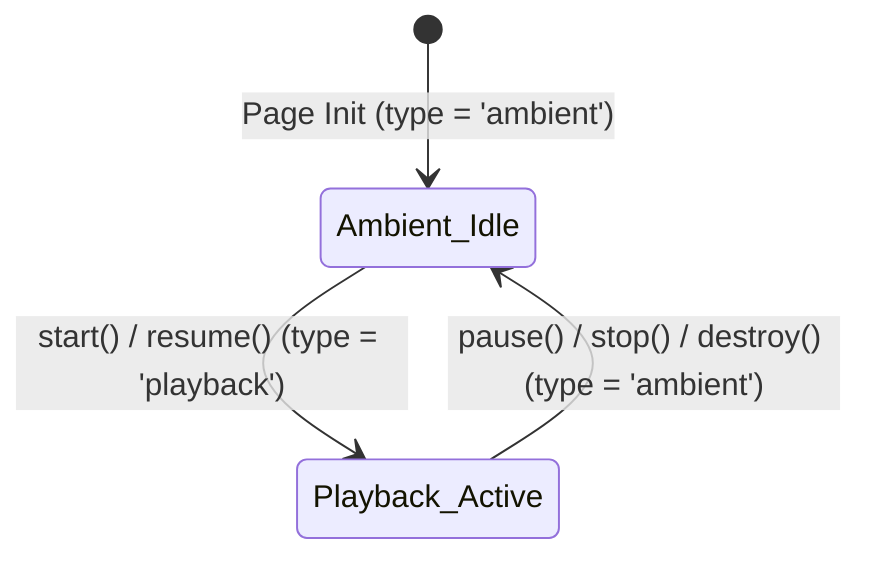

# 27. Dynamic iOS AudioSession: Ambient UI & Playback Metronome

Date: 2026-09-18

## Status
Accepted

## Context
On iOS and iPadOS (Safari and all WebKit-based mobile browsers), the operating system routes web audio through Apple's native CoreAudio `AVAudioSession` framework:
- By default, WebKit assigns `AudioContext` to `AVAudioSessionCategoryAmbient`.
- Under Apple's Human Interface Guidelines, "Ambient" audio represents non-essential background or interface sound effects (e.g. casual game chimes, button taps). The operating system is hardwired to completely silence all ambient audio whenever the hardware Ring/Silent switch, the Action Button, or the Control Center Silent Mode toggle is active.
- For a sight-reading and solfège practice engine like Guidonica, this meant that musicians practicing on iPhone or iPad heard no metronome clicks whenever their device was in silent mode.
- Conversely, user expectations dictate that non-essential interface sounds (such as future button clicks, switch toggles, or drawer swooshes) *should* be silenced when in silent mode, while essential practice audio (the streaming metronome clicks) must remain audible.

Historically, web developers resorted to heavy workarounds (such as `unmute.js`), which injected hidden `<audio>` DOM elements, downloaded dummy MP3 files over the network, and looped silent media tracks, polluting the iOS Lock Screen with ghost media player widgets and draining battery. Such patterns violate Guidonica's suckless, zero-bloat engineering philosophy.

## Decisions

### 1. W3C Audio Session API Integration
Safari on iOS 16.4+ natively supports the W3C Audio Session API (`navigator.audioSession`). This allows web applications to declare their audio session category directly to the operating system without external dependencies or DOM hacks:
- Strictly typed interfaces (`AudioSessionType`, `NavigatorAudioSession`) were added to `src/notation/types.ts`, extending the global `Navigator` interface with zero `any` assertions.
- The engine directly sets `navigator.audioSession.type` to communicate intent to WebKit's media pipeline.

### 2. Dynamic AudioSession State Machine
Because CoreAudio enforces a single active `AVAudioSession` category per process/tab at any given moment, Guidonica implements a dynamic lifecycle state machine inside `MetronomeEngine`:

1. **Idle / Stopped / Paused State (`type = 'ambient'`)**:
   - Upon initial load, upon `pause()`, upon `stop()`, and upon `destroy()`, the audio session category is set to `'ambient'`.
   - Any non-essential UI taps or future interface sounds strictly follow ambient rules: if the device is in silent mode, they are completely silenced.
   - Guidonica does not interrupt background music or podcasts (e.g., Spotify, Apple Podcasts) while the user is configuring settings or browsing the interface.
2. **Active Streaming State (`type = 'playback'`)**:
   - Immediately when the user starts or resumes practice (`start()`, `resume()`), `MetronomeEngine` elevates `navigator.audioSession.type` to `'playback'`.
   - Metronome clicks (synthesized live via native `OscillatorNode` pitch sweeps and exponential envelopes) cut through the hardware silent switch, honoring the device's media volume slider.
   - Synchronization with the visual playhead remains mathematically locked to `AudioContext.currentTime`.
3. **Relinquish on Pause / Stop**:
   - As soon as playback stops or pauses, the engine immediately reverts `navigator.audioSession.type` back to `'ambient'`, releasing the playback hold.

### 3. Graceful Fallback & Zero-Download Hygiene
- Feature detection (`typeof navigator !== 'undefined' && 'audioSession' in navigator && navigator.audioSession`) ensures flawless execution in non-supporting browsers (desktop Chrome, Firefox, Node.js/Vitest test runner).
- Defensive guards in `MetronomeEngine.ensureAudioContext()`, `pause()`, and `resume()` ensure state transitions remain completely error-free in headless or simulated environments.
- 0 bytes downloaded over the network. 0 npm dependencies added.

## Consequences

### Positive
- **Audible Sight-Reading on iOS**: Metronome clicks now sound clearly on iPhone and iPad even when silent mode is active.
- **Ambient UI Compliance**: The web app strictly honors silent mode for non-essential sounds when idle or paused.
- **Zero Framework Bloat**: Accomplished in ~25 lines of clean, strictly typed TypeScript without third-party libraries or DOM hacks.
- **No Lingering Lock Screen Widgets**: Because the audio session category reverts to `'ambient'` when stopped or paused, no persistent media playback widget lingers in the iOS Control Center.

### Considerations
- On iOS, `AVAudioSession` is an atomic process singleton. While the metronome is actively running, any sound produced by the tab operates under the `'playback'` category. Future non-essential UI sounds triggered during active playback can be routed through an explicit software mute gate if independent muting during active playback is desired.
